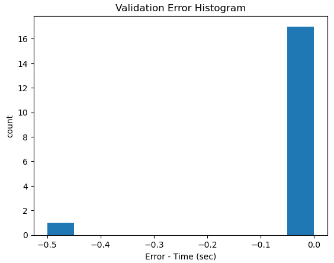
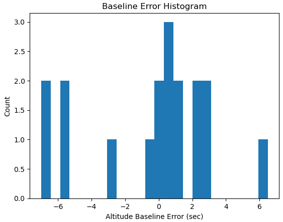

## Sci-Tech Code Test Report

### Introduction

From the viewpoint of building an LSTM model and predicting the reentry timestamp on an unseen validation data set carved out of the training data the project went very well. A simple LSTM model with some feature engineering performed on the data given appears to perform well. As the training data set was small, 20% was taken for the validation data which was not used for training the model. I have not seen any errors in the validation set that are greater than 0.50 seconds (one time step) in a fully trained model. Inference results are saved to a csv file in the logs folder for easy use in analysis. These carry the same timestamp as the inference log file for reference. 

Given the training data size of 90 segments, the 20% used for validation amounted to 18 missile launch and reentry events for validation testing. Of the 18 segments, none were off by more than 0.50 seconds (one timestamp). This resulted in an RMSE for validation of 0.118 seconds as only one track was in error in the most recent training run. Generally 1-6 tracks may be off by 0.50 seconds in the validation set but I have not observed any errors larger thaan 0.5 seconds in training. This compares to an RMSE of 3.659 seconds for the baseline of simply using the average altitude of reentry. The LSTM model has significantly better performance than the simple baseline proposed.The baseline altitude reentry method had errors up to 7 seconds.

  
  

The data appears noisy, however the model was able to work through the noise with the addition of some feature engineering (added data calculated from combinations of the data provided). If there was more time available, I would try some moving averages on the data to dampen noise but given the high accuracy of the model there is not much room for improvement on the available validation data.

### Feature Engineering

Features given for this model were minimal. Analysis with a Jupyter data exploration notebook suggested several possible new features. Altituude change was the first feature extracted from the data on a track-wise basis. A histogram of altitude change revealed that a flag for descending might be helpful when used wth a descent threshold. While there is noise in the altitude change, there are large gaps shown by the histogram that allow a descent threshold to work for an "is_descending" flag. All reentries in the training data file were found to be in the descending phase by plotting the data. This was practical given the data size.

Horizontal distance was computed from latitude and longitude using a haversine formula for great circle distance. From this total distance including altitude change was also computed. Along with the time step delta of 0.5 seconds this led to a velocity feature. All of these features helped the model to perform better in my initial testing and so were kept for the final model. The sensor ID column was dropped because it only had one unique value in the training data. The timestamps were all equally spaced which is needed for the LSTM model, there was no need to impute any missing data. Timestamp was not a feature used by the model, but it was used for ouutput data reporting.

Th entire sequence was passed to the model for each track ID. As an enhancement the model could, based on existing data, only consider the descent phase of the data. I did not know if this was acceptable for the project. It was tried and worked well but was discarded because it would depend on the flight profiles, which may be different if a failed launch happened.  

### The LSTM Model  

A relatively simple LSTM model was used with two LSTM layers and a linear output layer. This was originally intended as an initial model but it worked so well that it was kept and tuned to improve its performance. Two internal layers are use in each LSTM layer. Performance did not improve on the validation data set when larger models were tried. Experimentation led to using 260 epochs to train the model. Early stopping was tried but since the model was observed to always perform best near the end of its training it did not help. In fact, with this model it would sometimes stop early and this resulted in lower observed performance on the validation data. Cosine annealing was used too gradually lower the learning rate throughout training, having a low learning rate near the end of training appeared to improve the model.  

While regularization using batch normalization and dropout were called for in the assignment these were tried but left out of the proposed model because they decreased the performance of the model. Also, early stopping was proposed, but the model in multiple tests always performed best near the end of the allotted number of training steps and early stopping only caused poor performance when it was attempted. This is a shallow network with two LSTM layers and a linear layer, batch normalization is normally needed only on deeper networks. If we had a larger dataset and multiple GPUs we could use PyTorch DDP to train on multiple GPUs. In this case we would need to use the PyTorch synchronized batch normalization layer (torch.nn.SyncBatchNorm) to communicate the normalization between processes for consistency of the normalization if we needed batch normalization.  

### Monitoring

The training process is monitored with a standard Python log file. This provides a header which gives information about the training setup. Each training epoch logs the epoch number, training loss, validation loss, learning rate and the time to complete the epoch. The best epoch is then logged along with the total training time. A set of inferences are run and the inference times logged. The inference results are logged for each validation track in a format that allows for easy extraction into a csv file for later analysis. All log entries are timestamped and the log level noted. An RMSE is calculated for true vs. predicted reentry times and logged. Total time for the entire process is logged at the end of the file. An example training log file is located in the Python project files.

The inference process is similarly monitored with a standard Python log file, with a similar header. Inference results are formatted such that a csv file could be extracted from the log, and a csv file is provided by the output for analysis. The included log fields for each inference track are Track_id, Reentry Index, Reentry Time, and Inference Run Time. A total run time is also provided as the last log entry.  

### Commentary on Coding 

Robustness was achieved in the inference script by wrapping the critical functionality in try-except blocks. I have not observed any exceptions from this data, probably because it is free of problems like missing data entries. The inference script uses multi-processing for scalability but for our small amount of test (inference) data this actually is slower than simply processing in a loop. Thus, one would have to be sure of the need to scale to enough predictions to make the multi-processing worth its overhead. 

Logging is done using the standard Python logger set to the “info” level. A few debug statements were used in development and can be enabled when needed. Exceptions are caught and logged with a stack trace for analysis and debug.  Inference uses multi-processing, so an exception in a sub-process is caught and logged but allows other processes to complete successfully. Failed tracks are logged with an error message. Successful track IDs continue to process and output their results. The value of logging errors was confirmed by some inevitable mistakes during development. 

Maintaining backups was done by periodically moving the working code folder to a flash drive. In a work environment this could be performed by checking into a GIT branch. The code was formatted with Black and checked with MyPy. Unit testing was performed by pytest. A production product would be better with a configuration file, due to time limits the configuration is handled with constants set in the Python files.  

### Project Structure

For training the Python script app_train.py can be called from the top level of the project. This calls train.py and uses a file of utilities called utils.py. For inference the file app_inference.py may be called in the same manner. The apps are called from the top level, the only code in the app files is to call the main function of the relevant application located in the src folder. The utils.py file is located in a lib folder as much of the code is shared.   

### Containerization 

Deployment was done to a Docker container and the code fully tested from there. Both training and inference worked as well with the container as they did in command line testing in Linux, which is to say that they worked very well. 

However, there were two problems. First, the docker container with GPU support was too large to send via an email. Checking with ChatGPT this appears to be a difficult problem to solve as ChatGPT was expecting that even a runtime container for GPU usage would be as large as 5GB. I used an official PyTorch distribution for Docker, so perhaps with more Docker experience a smaller container can be built, but as noted above, ChatGPT was not optimistic about getting to under 25MB for an email.  

Second, Minikube proved to be either very difficult to install or incompatible with my Ubuntu 24.04 Linux distribution. Thus I was unable to install Minikube, which I have no experience with.  

I believe that if I were hired that these issues could be resolved easily by some mentoring.  Sci-Tech has containers that work and I am sure that I would quickly be able to successfully learn this part of the task. Especially noting that I had no difficulty building a Docker compatible with PyTorch and GPU usage. The recipe is noted in app_train.py and is as follows:  

+docker pull pytorch/pytorch:2.4.0-cuda12.1-cudnn9-runtime  
+docker build -t pytorch-app .  
+docker run -it --rm --gpus all -v \\$(pwd)/logs:/app/logs -v \\$(pwd)/model:/app/model -p 8898:8898 pytorch-app (gets a bash terminal)  
+python app_train.py (in the bash terminal)  
+python app_inference.py (in the bash terminal)  

### Running the Project without a Container

### Summary

The model and project appear successful except for the lack of Minikube and the difficulty of building a small enough docker image to email that has GPU support.  

