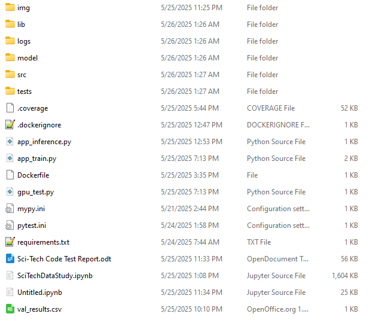

## Sci-Tech Code Test Report

### Introduction

From the viewpoint of building an LSTM model and predicting the reentry timestamp on an unseen validation data set carved out of the training data the project went very well. A simple LSTM model with some feature engineering performed on the data given appears to perform well. As the training data set was small, 20% was taken for the validation data which was not used for training the model. I have not seen any errors in the validation set that are greater than 0.50 seconds (one time step) in a fully trained model. Inference results are saved to a csv file in the logs folder for easy use in analysis. These carry the same timestamp as the inference log file for reference. 

Given the training data size of 90 segments, the 20% used for validation amounted to 18 missile launch and reentry events for validation testing. Of the 18 segments, none were off by more than 0.50 seconds (one timestamp). This resulted in an RMSE for validation of 0.118 seconds as only one track was in error in the most recent training run. Generally 1-6 tracks may be off by 0.50 seconds in the validation set but I have not observed any errors larger thaan 0.5 seconds in training. This compares to an RMSE of 3.659 seconds for the baseline of simply using the average altitude of reentry. The LSTM model has significantly better performance than the simple baseline proposed. 

The data appears noisy, however the model was able to work through the noise with the addition of some feature engineering (added data calculated from combinations of the data provided). If there was more time available, I would try some moving averages on the data but given the high accuracy of the model there is not much room for improvement on the available validation data. 

### Commentary on Coding 

While regularization using batch normalization and dropout were called for in the assignment these were tried but left out of the proposed model because they decreased the performance of the model. Also, early stopping was proposed, but the model in multiple tests always performed best near the end of the allotted number of training steps and early stopping only caused poor performance when it was attempted. It can also be noted that this is a shallow network with two LSTM layers and a linear layer, batch normalization is normally needed only on deeper networks. If we had a larger dataset and multiple GPUs we could use PyTorch DDP to train on multiple GPUs. In this case we would need to use the PyTorch synchronized batch normalization layer (torch.nn.SyncBatchNorm) to communicate the normalization between processes for consistency of the normalization. 

Robustness was achieved in the inference script by wrapping the critical functionality in try-except blocks. I have not observed any exceptions from this data, probably because it is free of problems like missing data entries. The inference script uses multi-processing for scalability but for our small amount of test (inference) data this actually is slower than simply processing in a loop. Thus, one would have to be sure of the need to scale to enough predictions to make the multi-processing worth its overhead. 

Logging is done using the standard Python logger set to the “info” level. A few debug statements were used in development. The exception that can is caught and allows the program to continue in inference logs the failed track ID. Failed tracks are logged with an error message. Successful track IDs continue to process and output their results. The value of logging errors was confirmed by some inevitable mistakes during development. 

Maintaining backups was done by periodically moving the working code folder to a flash drive. In a work environment this could be performed by checking into a GIT branch. The code was formatted with Black and checked with MyPy. Unit testing was performed by pytest. 

### Project Structure

For training the Python script app_train.py can be called from the top level of the project. This calls train.py and uses a file of utilities called utils.py. For inference the file app_inference.py may be called in the same manner. The apps are called from the top level, the only code in the app files is to call the main function of the relevant application located in the src folder. The utils.py file is located in a lib folder as much of the code is shared. 

### Containerization 

Deployment was done to a Docker container and the code fully tested from there. Both training and inference worked as well with the container as they did in command line testing in Linux, which is to say that they worked very well. 

However, there were two problems. First, the docker container with GPU support was too large for an email. Checking with ChatGPT this appears to be a difficult problem to solve as ChatGPT was expecting that even a runtime container for GPU usage would be as large as 5GB. I used an official PyTorch distribution for Docker, so perhaps with more Docker experience a smaller container can be built, but as noted above, ChatGPT was not optimistic about getting to under 25MB for an email.

Second, Kubernetes and Minikube proved to be either very difficult to install or incompatible with my Ubuntu 24.04 Linux distribution. Thus I was unable to install Minikube, which I have no experience with.

I believe that if I were hired that these issues could be resolved easily by some mentoring.  Sci-Tech has containers that work and I am sure that I would quickly be able to successfully learn this part of the task. Especially noting that I had no difficulty building a Docker compatible with PyTorch and GPU usage. The recipe is noted in app_train.py and is as follows:

+docker pull pytorch/pytorch:2.4.0-cuda12.1-cudnn9-runtime  
+docker build -t pytorch-app .  
+docker run -it --rm --gpus all -v \\$(pwd)/logs:/app/logs -v \\$(pwd)/model:/app/model -p 8898:8898 pytorch-app (gets a bash terminal)  
+python app_train.py (in the bash terminal)  

### Summary

The model and project appear successful except for the lack of Minikube and the difficulty of building a small enough docker image to email that has GPU support.  

